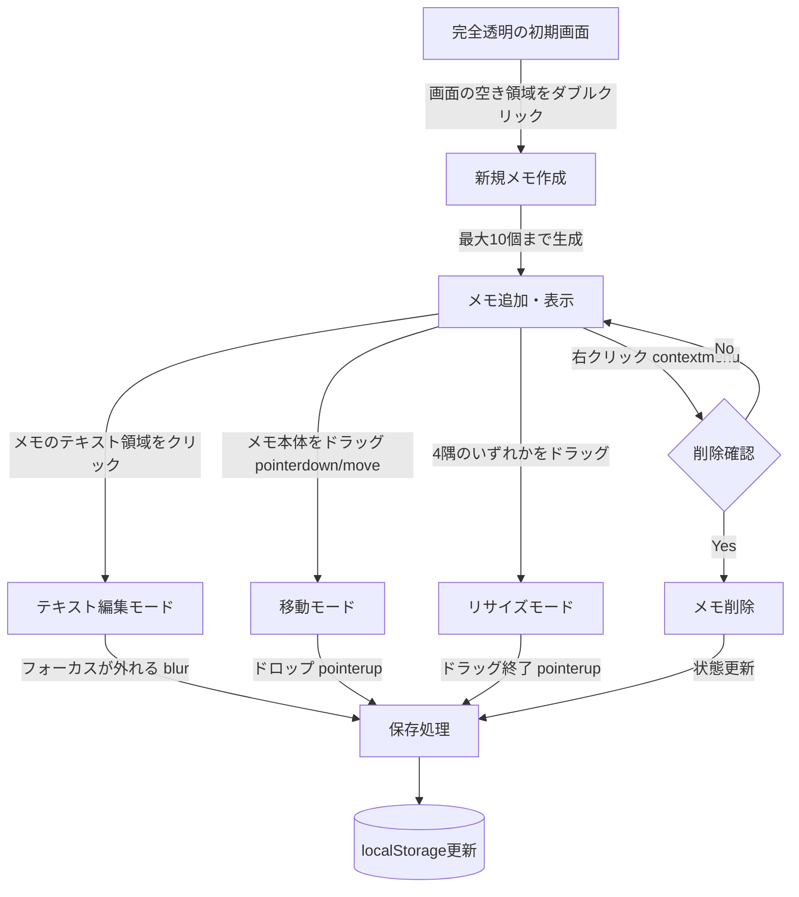

# 配信画面メモパッド 実装計画

OBSのブラウザソースとして使用できる、直感的な操作が可能なメモパッド機能（HTML/CSS/JSによる単一ファイル実装）を構築します。

## User Review Required

> [!IMPORTANT]
> 要件に基づき、以下の「UI操作フロー図」および「メモDOM構造」を作成しました。
> 内容をご確認いただき、問題なければ承認をお願いします（承認後に実装を開始します）。

### UI操作フロー図



### メモDOM構造

メモ一つにつき、以下の構造をJSで動的に生成します。

```html
<!-- メモ全体をラップ・絶対配置し、ドラッグの起点とする -->
<div class="memo" id="uuid-1234" style="left: 100px; top: 200px; width: 250px; height: 120px; z-index: 1;">
  
  <!-- テキスト編集領域（デザイン：黄マーカー風、半透明白背景） -->
  <div class="memo-content" contenteditable="true">
    次はこのゲームやる
  </div>

  <!-- リサイズ用ハンドル (4隅) -->
  <div class="resize-handle nw"></div> <!-- 左上 -->
  <div class="resize-handle ne"></div> <!-- 右上 -->
  <div class="resize-handle sw"></div> <!-- 左下 -->
  <div class="resize-handle se"></div> <!-- 右下 -->
  
</div>
```

**データの永続化構造 (localStorage `obs_memos`)**
```json
[
  {
    "id": "uuid-1234",
    "x": 100,
    "y": 200,
    "width": 250,
    "height": 120,
    "text": "次はこのゲームやる",
    "zIndex": 1
  }
]
```

## Proposed Changes

### フロントエンド実装

#### [NEW] index.html
外部ライブラリ不使用の単一ファイルです。以下の要素を含みます。
- **HTML**: UI要素を持たない、空の `body` またはコンテナで開始。
- **CSS**: 
  - `body { margin: 0; background: transparent; overflow: hidden; }` によるOBS透過背景・スクロールバー非表示の適用。
  - カスタムフォント（sans-serif準拠16px）、影付き、最小サイズ `100x50px` のメモデザイン。
- **JavaScript**: 
  - 初期化処理：localStorageから既存データを読み込み、メモDOM要素を再構築。
  - Pointer Eventsを使用したなめらかなドラッグ＆ドロップ、および4隅のリサイズ処理。
  - `ResizeObserver` や要素の座標検知、および `contenteditable` の `blur` または `MutationObserver` による変更検知とローカルストレージへの自動保存。
  - 最大生成数10個までの制御、超過時のアラート。

#### [NEW] README.md
GitHub Pagesへのデプロイを想定した設定手順や、OBSブラウザソースでの設定値（横1920縦1080、カスタムCSSなど）、操作方法、制限事項を記載します。

## Verification Plan

### Manual Verification
以下の項目を手動でテストします。
1. `index.html` をブラウザで開き、真っ白（OBS上では透明）であることを確認。
2. 画面ダブルクリックで新規メモが生成されること（10個まで。11個目は警告が出るかテスト）。
3. メモをクリックしテキストが入力できること、外をクリックで内容が保存されること。
4. メモをドラッグして移動できること、4隅のハンドルでリサイズ（最小サイズ確保）できること。
5. メモを右クリックで削除確認ダイアログが開き、削除できること。
6. 一度ページをリロードし、以前のメモが全て適切な位置・サイズ・内容で再描画されること。
